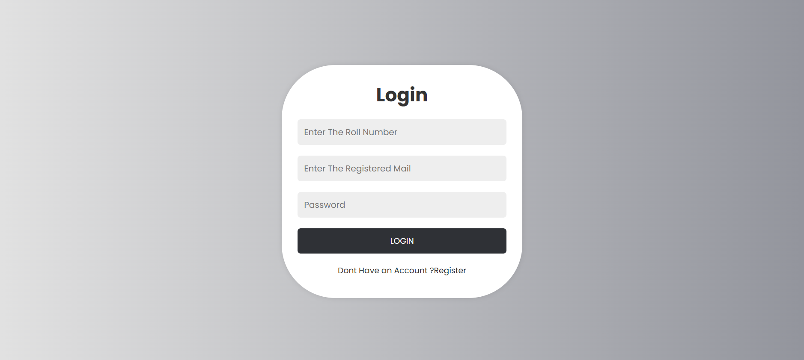
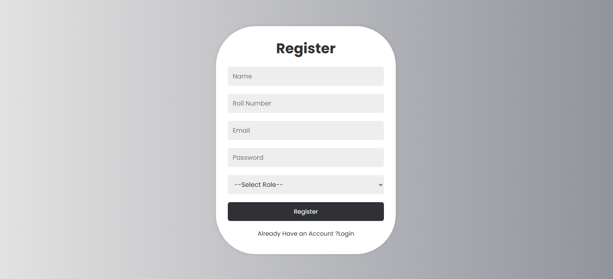
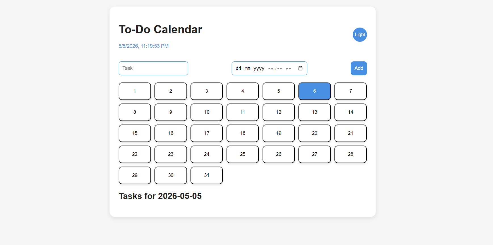
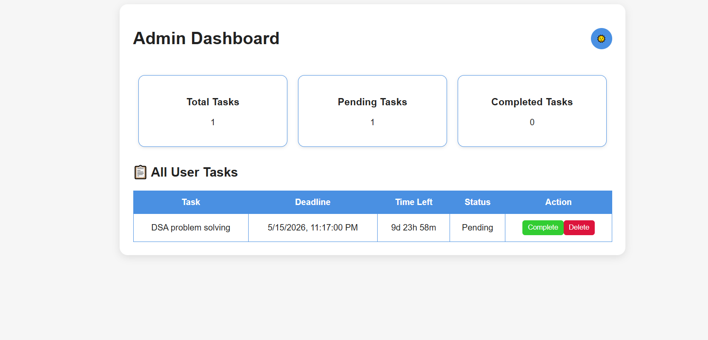

# To-Do Calendar & Admin Management System

---

## system.identity

```
name        : To-Do Calendar & Admin Management System
type        : full-stack web application
architecture: role-based (user / admin)
status      : active
version     : 1.0.0
stack       : Node.js · Oracle DB · JWT
```

---

## system.overview

This system is designed to manage tasks through a structured, time-oriented approach.

Users interact with tasks via a calendar interface, while administrators maintain
full system visibility and control. The project focuses on combining frontend interaction,
backend logic, and role-based access into a single working system.

---

## modules

### user.module

```
- calendar-based task interaction
- date selection and task assignment
- deadline tracking with time-left calculation
- local storage persistence
- interface theme switching
```

---

### admin.module

```
- global task visibility
- system statistics:
    total / pending / completed
- task lifecycle control:
    mark complete / delete
```

---

### auth.module

```
- role-based registration (user / admin)
- password hashing using bcryptjs
- token-based authentication using JWT
- dynamic routing based on user role
```

---

### backend.module

```
- Node.js runtime environment
- Express.js routing
- Oracle database integration
- user credential and role storage
```

---

## tech.stack

```
frontend  : HTML, CSS, JavaScript
backend   : Node.js, Express.js
database  : Oracle XE
security  : bcryptjs, jsonwebtoken
```

---

## system.visuals






---

## current.state

```
- frontend and backend integrated
- user and admin workflows operational
- authentication system functional
- project stable for local execution
```

---

## pending.upgrades

```
- migrate task storage to database
- implement notification system
- improve mobile responsiveness
- add user activity tracking
```

---

## execution

```
npm install
node server.js
```

---

## system.note

This project represents a transition from interface-driven development
to building complete systems that manage users, roles, and data together.
